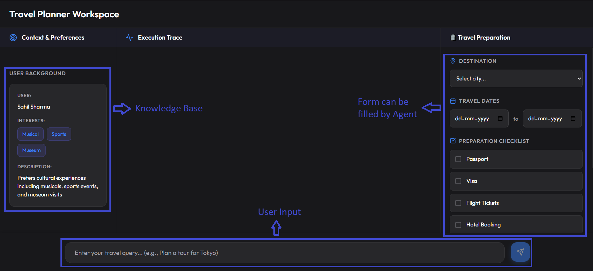
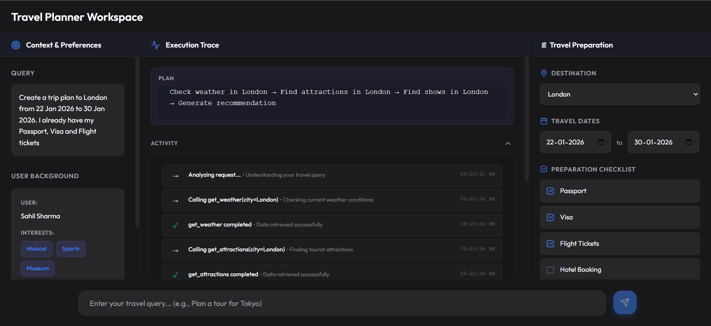
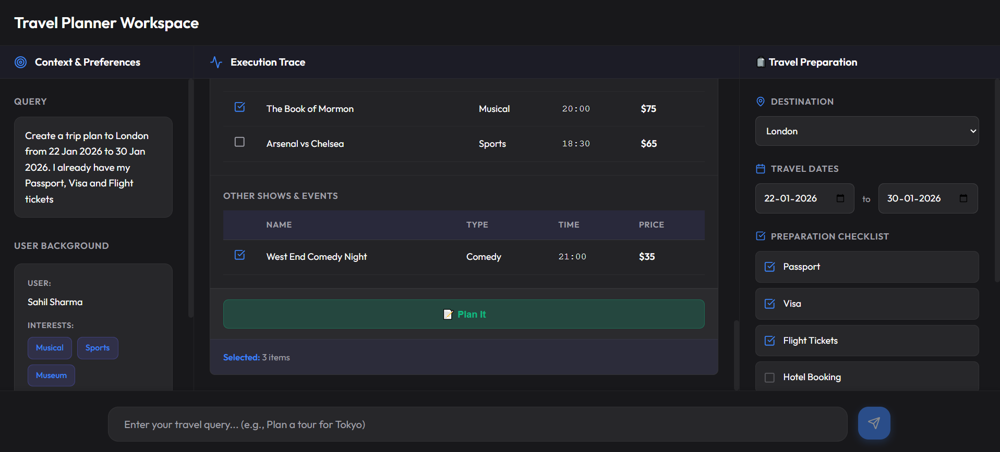
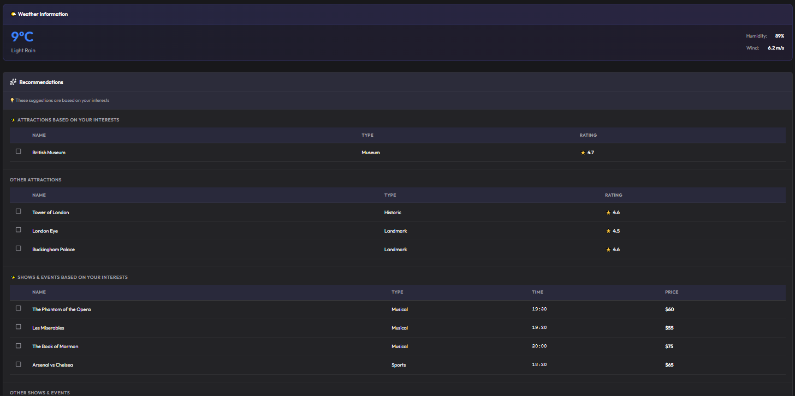

# Travel Agent AI Planner 🌍

A **full-stack AI-powered travel planning application** built with **FastAPI** and **React**.
This project showcases a **multi-turn, agentic workflow** capable of tool usage, structured data extraction, real-time UI synchronization, and personalized itinerary generation.

---

## 🚀 Project Overview

**Why this use case?**

Travel planning is more than simple question–answering—it is a **coordination and decision-making problem**. 
This project was built to demonstrate how an AI agent can:

- Gather and reason over **high-entropy, real-world data**
- Respect **user constraints** such as dates and interests
- Maintain and synchronize **agent state with a visual UI**
- Deliver a **clear, actionable itinerary**, not just text responses

> **Key Differentiator:** Instead of providing wall-of-text answers, this system uses **Client Actions** to proactively sync the agent's findings with the interactive UI—filling out preparation forms and building live recommendation tables as the conversation progresses.

### Main Interface


---

## ✨ Key Design Principles

### 1. Intelligent State Synchronization
Travel planning is inherently visual. Instead of producing long text outputs, the agent proactively updates the UI by emitting **Client Actions**:
- Auto-fills forms
- Updates tables
- Enables downloads when the plan is complete

This removes the cognitive load from the user and keeps the UI aligned with the agent’s “mental model”.

### 2. Persona & Preference Alignment
The agent leverages local **knowledge storage** (user profile and interests) to filter and rank results.  
For example, if the user prefers **Theater**, cultural experiences are prioritized over generic attractions.

---

## 🧠 How the Agent Works

### Step 1: Query Understanding & Planning
The user’s request is parsed, structured, and converted into an execution plan with traceable reasoning.



---

### Step 2: Automated Form Filling
As soon as relevant details (destination, dates, preferences) are identified, the agent populates the travel form automatically.



---

### Step 3: Tool Execution & Reasoning
The agent gathers external and internal data, applies constraints, and refines recommendations based on preferences.

---

### Step 4: Final Response & Recommendations
The system produces a curated, preference-aware travel plan synchronized with the UI.



---

### Step 5: Exportable Itinerary
Once the plan is finalized, the user can download the complete itinerary as a PDF.

📄 **Sample Output**:  
[Download Travel Itinerary PDF](assets/travel_itinerary_1769027141005.pdf)

---

## 🛠 Capabilities & Tools

### 🔧 Server-Side Tools

The agent has access to programmatic tools for gathering real-time data:

- `get_weather(city)`: Fetches current weather conditions via OpenWeatherMap API
- `get_attractions(city)`: Retrieves top-rated tourist landmarks and points of interest
- `get_shows(city)`: Finds current entertainment, theater, and sports events

### 🖥 Client-Side Actions

The backend triggers specific UI state changes through action events:

- `update_travel_form`: Automatically populates the sidebar with destination, dates, and checklist items when relevant information is detected
- `auto_select_preferences`: Highlights recommendations that align with stored user interests
- `user_approval`: The user can select their preferences, finalize the plan, and download it as a PDF

> Beyond domain-specific actions, the agent can also issue meta UI commands (e.g., switching themes) directly to the client, demonstrating browser-level control via natural language.

---

## 🧠 Knowledge Management

**Location**: `backend/knowledge.json`

The knowledge base serves three critical functions:

1. **Persona Consistency**: Stores user name and bio, allowing the agent to personalize interactions and maintain context across conversations.
2. **Interest Alignment**: Uses preference data to rank and highlight attractions. For example, a user interested in theater receives theater recommendations over sports stadiums.
3. **Implicit Context**: Acts as persistent context across sessions, complementing the short-term conversation history.

---

## 💻 Technology Stack

| Layer | Technology |
|-------|-----------|
| **Backend** | FastAPI, OpenAI GPT-4o, Pydantic |
| **Frontend** | React (Vite), Lucide Icons, Vanilla CSS |
| **Automation** | PowerShell and Bash scripts |

---

## ⚙️ Getting Started

### 1. Prerequisites

- Python 3.9 or higher
- Node.js 18 or higher
- API Keys: OpenAI and OpenWeatherMap

### 2. Environment Setup

Create a `.env` file in the `backend/` directory with your API credentials:

```env
OPENAI_API_KEY=your_openai_key
OPENWEATHERMAP_API_KEY=your_weather_key
```

### 3. Running the Application

The project includes unified deployment scripts that manage virtual environments, install dependencies, and launch both backend and frontend services.

**Windows (PowerShell):**
```powershell
powershell -ExecutionPolicy Bypass -File ./run.ps1
```

**macOS / Linux (Bash):**
```bash
chmod +x run.sh
./run.sh
```

---

## ⬇️ Downloading Your Trip Plan

Once your itinerary is finalized, download it as a PDF using the provided export feature. Your personalized travel plan will include all recommendations, weather data, and scheduling information.

---

## ⚖️ Design Decisions & Tradeoffs

### Current Implementation

- **In-Memory Sessions**: Conversation history is stored in memory. Production deployments would use Redis or PostgreSQL for scalability.
- **Static Knowledge Base**: User preferences are loaded from JSON. Production systems would use database-backed profile endpoints.
- **Partially Mocked Data**: While weather is real-time, attractions and show listings are curated to ensure consistent demo behavior.

### Future Enhancements

- **Production Persistence**: Migrate to cloud databases (Supabase, Firebase) for user profiles and chat history
- **Multi-City Routing**: Enable complex itineraries spanning multiple destinations
- **Architectural Scaling**: Adopt **LangGraph** for stateful multi-goal workflows and **LangChain** for standardized tool abstractions as complexity increases

---

📬 For questions or collaboration, feel free to reach out at: mr.sahilsharma50@gmail.com
